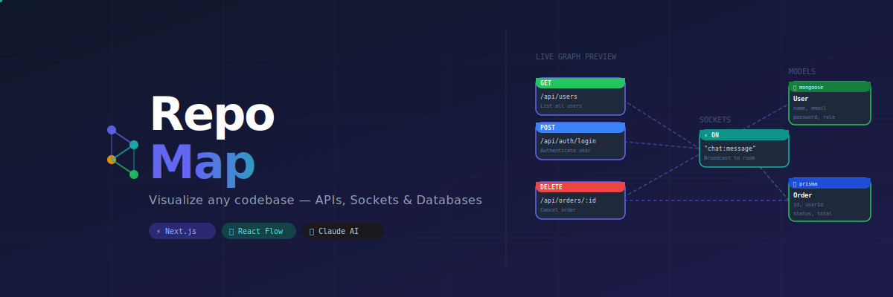

# RepoMap



**Paste a GitHub URL. Instantly see every API, WebSocket event, and database model — visualized as an interactive graph.**


---

## What is RepoMap?

RepoMap is a developer tool that reverse-engineers any public GitHub, GitLab, or Bitbucket repository and generates an **interactive visual map** of its backend architecture. No manual documentation needed — just paste a repo URL and get a complete picture of:

- Every REST API endpoint — method, path, auth requirements, and URL parameters
- Every WebSocket / Socket.io event — event name, direction (emit/on/broadcast)
- Every database model — fields, types, and relations
- How they connect — which API touches which model, drawn as animated edges

AI-powered descriptions (via Claude) explain what each endpoint actually **does** in plain English — not just `GET /users` but `"Fetch paginated list of active users with role filter"`.

---

## Features

### Deep Code Analysis

- Detects Express, Fastify, NestJS, Next.js App Router, and more
- Extracts route paths, HTTP methods, URL params, and auth middleware
- Reads function bodies to understand business logic

### AI-Powered Descriptions

- Uses **Claude Haiku** to read each handler's source code and generate a natural-language description of what it actually does
- Understands: auth flows, payment processing, file uploads, email sending, background jobs, webhooks, and more
- Falls back gracefully to regex analysis if no API key is configured

### 30+ Databases Supported

| Category | Databases |
| --- | --- |
| SQL ORMs | Prisma, Sequelize, TypeORM, Drizzle, Knex.js, MikroORM, Objection.js |
| Document | MongoDB, Mongoose, CouchDB, PouchDB, FaunaDB |
| Key-Value / Cache | Redis, Upstash, LevelDB |
| Cloud / Serverless | Firebase, Supabase, DynamoDB, PlanetScale, Neon, Turso |
| Graph | Neo4j, ArangoDB, OrientDB, RethinkDB |
| Search / Analytics | Elasticsearch, InfluxDB, ClickHouse |
| Other | Cassandra, TimescaleDB, LokiJS, SQLite, CockroachDB |

### Interactive Graph UI

- Built with **React Flow** — pan, zoom, drag nodes freely
- Three view modes: **Split** (list + graph), **List only**, **Graph only**
- Click any item in the list → graph animates to focus that node
- Color-coded nodes by HTTP method and database type

### Live Search and Filter

- Search across APIs, sockets, and models simultaneously
- Collapsible sections with match counts

---

## Getting Started

### 1. Clone and install

```bash
git clone https://github.com/your-username/repomap.git
cd repomap
npm install
```

### 2. Configure AI descriptions (optional but recommended)

Create a `.env.local` file:

```env
ANTHROPIC_API_KEY=sk-ant-api03-...your-key-here...
```

Get your key at [console.anthropic.com](https://console.anthropic.com/). Without a key, RepoMap still works — it uses regex-based analysis instead.

### 3. Run

```bash
npm run dev
```

Open [http://localhost:3000](http://localhost:3000), paste any public repo URL, and click **Analyze**.

---

## Example Repos to Try

```text
https://github.com/expressjs/express
https://github.com/nestjs/nest
https://github.com/gothinkster/node-express-realworld-example-app
https://github.com/hagopj13/node-express-boilerplate
```

---

## How It Works

```text
User pastes URL
      │
      ▼
git clone --depth 1   (shallow clone, no history)
      │
      ▼
Walk .js / .ts / .jsx / .tsx files
      │
      ├── apiDetector.ts    → finds routes & extracts function bodies
      ├── socketDetector.ts → finds socket.on / socket.emit events
      └── dbDetector.ts     → finds models across 30+ DB libraries
      │
      ▼
llmDescriber.ts  → batch-sends all bodies to Claude in one API call
      │
      ▼
graphBuilder.ts  → builds React Flow nodes & edges
      │
      ▼
Interactive graph rendered in the browser

Clone is deleted from disk immediately after analysis
```

---

## Tech Stack

| Layer | Technology |
| --- | --- |
| Framework | Next.js 16 (App Router) |
| Language | TypeScript 5 |
| Styling | Tailwind CSS 4 |
| Graph | React Flow 11 |
| AI | Anthropic Claude Haiku |
| Repo cloning | `git clone --depth 1` via Node.js |
| Code analysis | Regex + AST-free file walking |

---

## Security

- Only **public** GitHub, GitLab, and Bitbucket HTTPS URLs are accepted
- Cloned repos are stored in a **temp directory** and deleted immediately after analysis
- No repo code is stored or logged

---

## License

MIT
